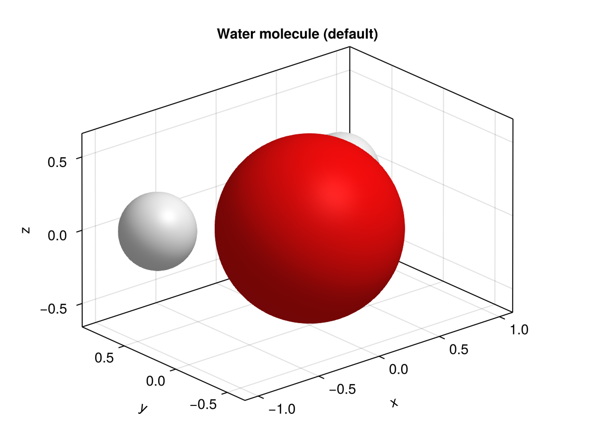
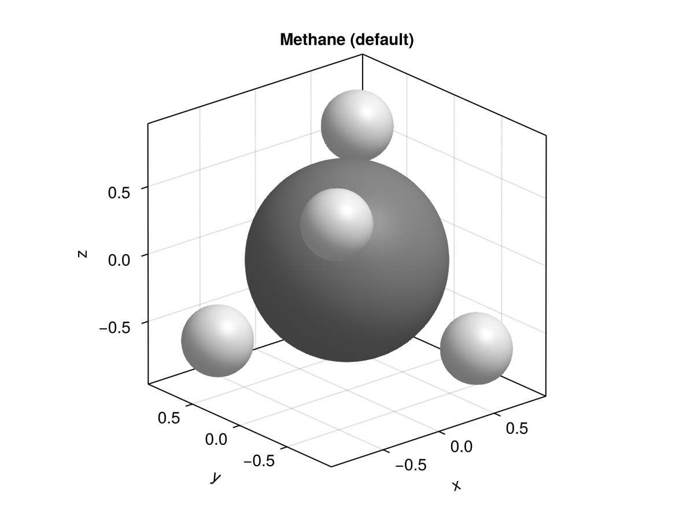
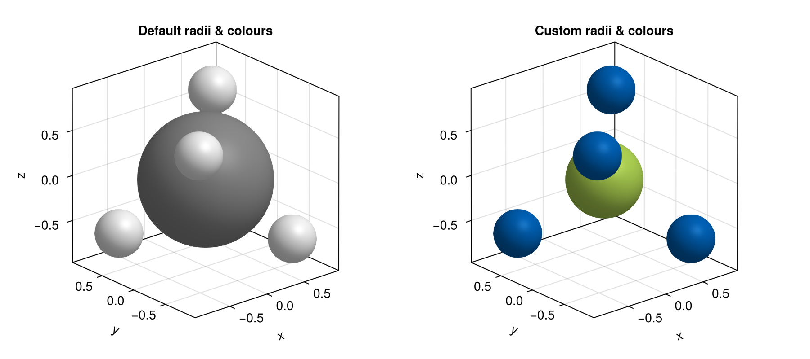
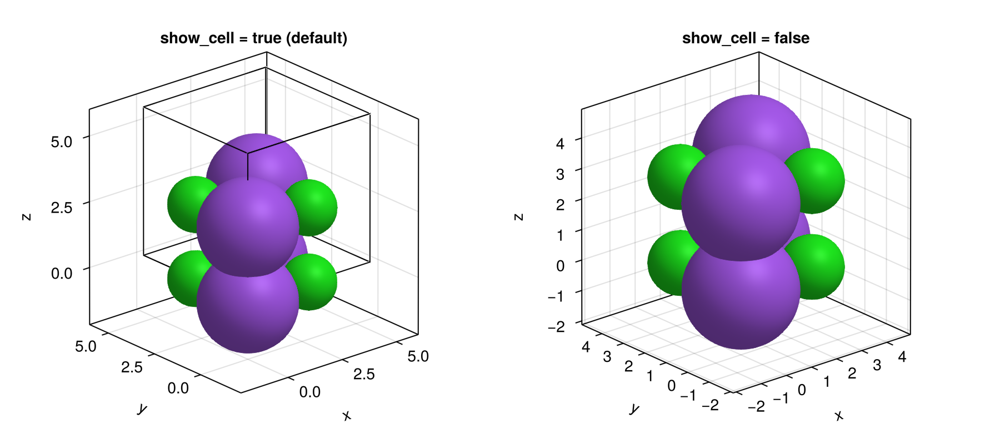
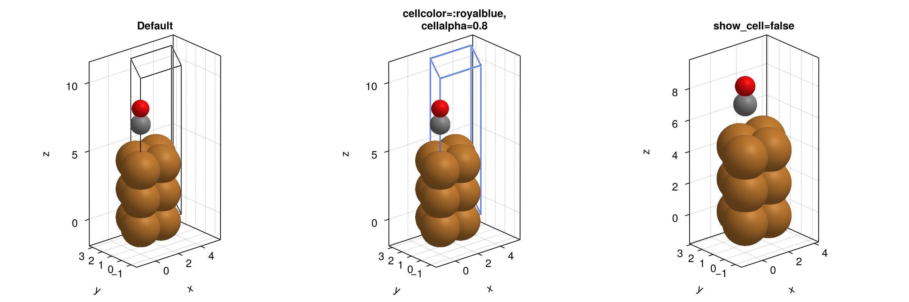

# NQCPlots - Plotting recipes for NQCD structures

[](https://github.com/alexsp32/NQCPlots.jl/actions/workflows/CI.yml?query=branch%3Amain)
[](https://codecov.io/gh/alexsp32/NQCPlots.jl)

## Roadmap
- [x] Basic recipe for atoms in 3d axis. 
- [ ] Default axis settings so that the plot looks good without needing to set limits, aspect ratio, etc. (depends on Makie updates to include this for recipes)
- [ ] 2D plotting recipe with correctly sized markers. 
  - [ ] Structure rotation for plotting on 2d axes. 

---

## Installation

NQCPlots.jl is not yet registered in the Julia General registry. Install directly from GitHub:

```julia
using Pkg
Pkg.add(url="https://github.com/alexsp32/NQCPlots.jl")
```

A Makie backend must also be available in your environment.
[GLMakie](https://github.com/MakieOrg/Makie.jl/tree/main/GLMakie) is the recommended
backend because it uses GPU-accelerated rendering with correct 3D depth sorting.
[CairoMakie](https://github.com/MakieOrg/Makie.jl/tree/main/CairoMakie) can also be
used (e.g. in headless CI environments), but its software renderer does not perform
depth sorting, so atom spheres and cell wireframes may be drawn in the wrong order.

```julia
Pkg.add("GLMakie")  # recommended; use "CairoMakie" for headless/CI environments
```

---

## Quick Start

```julia
using GLMakie
using NQCBase
using NQCPlots

# Build a simple structure (positions in atomic units / Bohr)
atoms     = Atoms([:O, :H, :H])
positions = [0.0  1.43  -1.43;
             0.0  1.11   1.11;
             0.0  0.0    0.0 ]
structure = Structure(atoms, positions, InfiniteCell())

# Plot with the recommended theme applied
with_theme(atomic_structures_theme) do
    fig, ax, plt = atoms3d(structure)
    display(fig)
end
```



---

## Usage

NQCPlots.jl provides:

- **`atomic_structures_theme`** – a Makie `Theme` that sets sensible axis defaults.
- **`Atoms3D` / `atoms3d` / `atoms3d!`** – a Makie recipe that renders an
  `NQCBase.Structure` as a 3-D ball model using `meshscatter`.

### Input type

Both the recipe and the theme work with `NQCBase.Structure` objects.
A `Structure` bundles together:

| Field | Type | Description |
|---|---|---|
| `atoms` | `NQCBase.Atoms` | Element symbols, atomic numbers and masses |
| `positions` | `AbstractMatrix` | 3 × N matrix of atom positions **in atomic units (Bohr)** |
| `cell` | `AbstractCell` | Either `PeriodicCell` (with lattice vectors) or `InfiniteCell` |

> **Unit note:** positions stored in `Structure` are expected to be in atomic units
> (Bohr). The recipe converts them to Ångströms internally before plotting, so all
> axis tick labels are in Å.

---

### `atomic_structures_theme`

A pre-built Makie `Theme` that enforces a 1:1:1 aspect ratio so that atoms are
rendered as proper spheres rather than ellipsoids:

```julia
const atomic_structures_theme = Theme(
    Axis  = (aspect = Makie.DataAspect(),),
    Axis3 = (aspect = :data,),
)
```

Wrap your plotting code in `with_theme(atomic_structures_theme) do … end`, or merge
it with your own theme using `merge(atomic_structures_theme, my_theme)`.

> Without this (or an equivalent `aspect` setting), the spheres will be stretched to
> fill the axis box, which gives misleading size comparisons between elements.

---

### `Atoms3D`

Renders the 3-D ball model of an `NQCBase.Structure`.
The recipe always plots into an `Axis3`.

**Function signatures**

```julia
# Create a new Figure + Axis3 + plot
fig, ax, plt = atoms3d(structure; kwargs...)

# Add into an existing Axis3
atoms3d!(ax, structure; kwargs...)
```

#### Example – molecules with default settings

```julia
with_theme(atomic_structures_theme) do
    fig = Figure(size = (900, 400))
    ax1 = Axis3(fig[1,1]; aspect = :data, title = "Water")
    ax2 = Axis3(fig[1,2]; aspect = :data, title = "Methane")
    atoms3d!(ax1, water)
    atoms3d!(ax2, methane)
end
```

| Water (H₂O) | Methane (CH₄) |
|---|---|
|  |  |

Atom colours follow the
[CPK convention](https://en.wikipedia.org/wiki/CPK_coloring) sourced from
`PeriodicTable.jl` (e.g. red for oxygen, light grey for hydrogen, dark grey for
carbon). Atom radii are the empirical atomic radii (in pm) from the
[Wikipedia data page](https://en.wikipedia.org/wiki/Atomic_radii_of_the_elements_(data_page)),
converted to Å for rendering.

---

#### Keyword arguments

##### Atom appearance

| Keyword | Type | Default | Description |
|---|---|---|---|
| `atomicradii` | `Dict{Symbol,Float64}` | empirical radii in Å | Maps element symbols to sphere radii (in Å). |
| `atomcolors` | `Dict{Symbol,Colorant}` | CPK colours | Maps element symbols to fill colours. |
| `marker` | Makie geometry | high-res sphere (128-tessellation) | Mesh geometry used for each atom. The default is a high-resolution sphere. For very large structures consider a lower-tessellation mesh to reduce file size. |
| `strokewidth` | `Real` | `1.5` | Edge stroke width in pt. *Currently defined as a recipe attribute but not yet applied to atom markers (reserved for a future Makie release that supports `strokewidth` on `meshscatter`).* |
| `atomsstrokecolormultiplier` | `Real` | `0.5` | Multiplier applied to the fill colour to derive the edge (stroke) colour. *Currently defined as a recipe attribute but not yet applied to atom markers (see note above).* |

**Overriding radii and colours**

```julia
with_theme(atomic_structures_theme) do
    atoms3d(methane;
        atomicradii = Dict(:C => 0.40, :H => 0.25),
        atomcolors  = Dict(:C => colorant"#222222", :H => colorant"#dddddd"),
    )
end
```



The left panel uses the defaults; the right panel uses the custom dictionaries above.
Note that only elements present in the structure need entries in the supplied
dictionaries — missing elements fall back to the defaults.

---

##### Cell boundaries

When the structure has a `PeriodicCell`, the recipe can draw a wireframe outline of
the unit cell as a guide to the eye.

| Keyword | Type | Default | Description |
|---|---|---|---|
| `show_cell` | `Bool` | `true` | Whether to draw the unit cell wireframe. Has no effect for `InfiniteCell` structures. |
| `cellcolor` | `Colorant` | `colorant"black"` | Colour of the cell wireframe lines. |
| `celllinewidth` | `Real` | `1.0` | Line width of the cell wireframe in pt. |
| `cellalpha` | `Real` | `1.0` | Opacity (alpha) of the cell wireframe lines. |

**`show_cell` on a NaCl unit cell**

```julia
with_theme(atomic_structures_theme) do
    fig = Figure(size = (900, 400))
    ax1 = Axis3(fig[1,1]; aspect = :data, title = "show_cell = true (default)")
    ax2 = Axis3(fig[1,2]; aspect = :data, title = "show_cell = false")
    atoms3d!(ax1, nacl)
    atoms3d!(ax2, nacl; show_cell = false)
end
```



**Changing `cellcolor`, `celllinewidth` and `cellalpha`**

```julia
with_theme(atomic_structures_theme) do
    fig = Figure(size = (1200, 400))
    ax1 = Axis3(fig[1,1]; aspect = :data, title = "Default")
    ax2 = Axis3(fig[1,2]; aspect = :data, title = "cellcolor=:royalblue, cellalpha=0.8")
    ax3 = Axis3(fig[1,3]; aspect = :data, title = "show_cell=false")
    atoms3d!(ax1, slab)
    atoms3d!(ax2, slab; cellcolor = :royalblue, cellalpha = 0.8, celllinewidth = 2.0)
    atoms3d!(ax3, slab; show_cell = false)
end
```



The cell wireframe is drawn using Makie's `poly!` primitive, so it is always rendered
on top of the atom spheres from certain camera angles. Adjusting `cellalpha` can help
reduce occlusion (centre panel above).

---

#### Notes and tips

- **`rasterize = true`** is applied to the `meshscatter` call by default. This keeps
  vector-format output files (PDF, SVG) manageable when there are many atoms, because
  each sphere is rasterised rather than stored as a vector mesh.
- **Periodic structures** — the recipe plots only the atoms explicitly present in
  `structure.positions`. To visualise periodic images, build a supercell first using
  `NQCBase.Supercell` before passing it to `atoms3d`.
- **`InfiniteCell` structures** — `show_cell` has no effect; no wireframe is drawn
  because there is no finite cell to outline.
- **Aspect ratio** — always apply `atomic_structures_theme` (or set `aspect = :data`
  on your `Axis3` manually). Without it the axis box rescales the spheres
  independently in each dimension, making them look like ellipsoids.